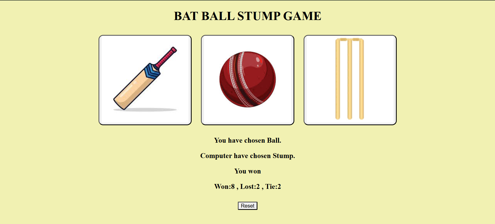

# 🏏 Cricket Game – Browser-Based Mini Game

A simple, interactive browser-based cricket game built using HTML, CSS, and JavaScript.

---

## 📂 Project Structure
📁 cricketGame/
├── imporovedCricketGame.html # Main game file
├── style.css # Game styling
├── bat.jpeg # Bat image
├── ball.jpeg # Ball image
├── stump.png # Stump image

---

## 🚀 Features

- Fun cricket game mechanics
- Click to hit the ball with the bat
- Simple UI using images
- Lightweight and fast in-browser experience

---

## 🛠️ How to Run

1. Download or clone the repository.
2. Open `imporovedCricketGame.html` in any web browser.
3. Play the game by clicking on the screen to hit the ball.

---

## 📸 Preview

---

## 📌 Notes

- Best viewed on desktop.
- You can customize the bat, ball, or background by replacing the images.

---

## 📄 License

MIT License – Feel free to use, modify, and distribute.
